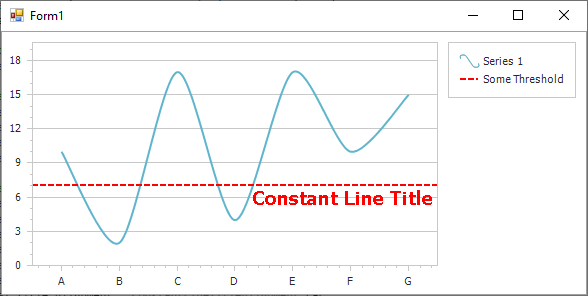

<!-- default badges list -->

<!-- default badges end -->

# Chart for WinForms - How to Create and Customize Constant Line

This example demonstrates how create and customize a [constant line](https://docs.devexpress.com/WindowsForms/5783/controls-and-libraries/chart-control/axes/constant-lines) at runtime.

Since constant lines belong to a diagram's [axis](https://docs.devexpress.com/WindowsForms/5779/controls-and-libraries/chart-control/diagram/axes), it is required to cast the [diagram](https://docs.devexpress.com/WindowsForms/5778/controls-and-libraries/chart-control/diagram) object to the appropriate diagram's type. After that, you can access axes and manage their constant lines collection.

## Files to Review

* [Form1.cs](./CS/ConstLines/Form1.cs) (VB: [Form1.vb](./VB/ConstLines/Form1.vb))

## Documentation

* [Constant Lines](https://docs.devexpress.com/WindowsForms/5783/controls-and-libraries/chart-control/axes/constant-lines)
